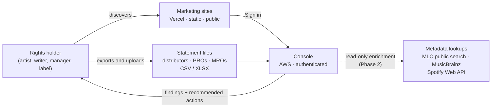
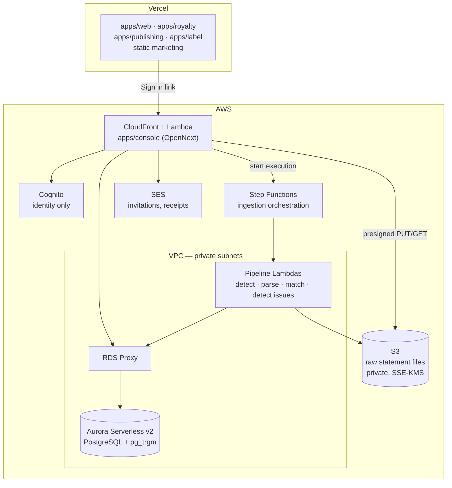
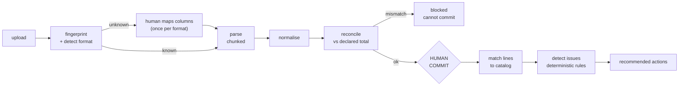

# Architecture overview

## What this system is

Source Royalty answers *"what should I do today to recover and grow royalty income?"* rather than
*"what did I earn?"*. That difference drives the architecture: the system's job is not to display
statements, it is to **normalise** them into one model, **match** their lines to a catalog, and
**detect** actionable problems with evidence.

The defensible asset is the normalisation + matching + audit layer. Reporting is a consequence of
having it.

## Context

Note what is **absent**: there are no royalty-data API integrations, because they do not exist for
third parties. See [ADR 0005](../adr/0005-statement-files-not-connector-apis.md).

## Containers

Aurora has **no public endpoint**. It is reachable only from inside the VPC, which is the reason
the console is hosted on AWS rather than Vercel — see
[ADR 0002](../adr/0002-aws-over-managed-vercel-backend.md).

## Code layout

| Path | Package | Responsibility |
| --- | --- | --- |
| `apps/console` | `@source/console` | The product. Authenticated Next.js app, `noindex`. |
| `apps/web`, `apps/royalty`, `apps/publishing`, `apps/label` | — | Marketing sites. Unchanged, still on Vercel. |
| `packages/ui` | `@source/ui` | Design system, shared by marketing and console. |
| `packages/db` | `@source/db` | Drizzle schema, migrations, tenant-scoped client. |
| `packages/domain` | `@source/domain` | Pure logic: identifiers, matching, rules, compliance lexicon. No DB, no AWS, no React. |
| `packages/ingest` | `@source/ingest` | Format registry, parsers, normalisers. |
| `infra/`, `sst.config.ts` | — | SST v3 infrastructure definitions. |

`packages/domain` is deliberately dependency-free so every rule and scorer is unit testable in
isolation, and so tooling (including the compliance check) can import it.

## The one flow that matters

Everything else is CRUD around this:

Three properties of this flow are load-bearing and each has an ADR:

1. **Raw rows are immutable**; normalised values are derived and re-derivable
   ([0008](../adr/0008-raw-immutable-normalized-derived.md)).
2. **Nothing is trusted without the commit gate**, and reconciliation can block it
   ([0009](../adr/0009-human-commit-gate.md)).
3. **Issues come from deterministic rules**, never a model
   ([0010](../adr/0010-deterministic-rules-not-ai.md)).

Full detail, including every `statement_file.status` transition and the failure and quarantine
paths, goes in `architecture/data-flow.md` — an M2 deliverable.

## Cross-cutting rules

- **Every row carries `org_id`.** Tenant scoping goes through `packages/db/src/tenant.ts`, with
  Postgres RLS as defence in depth.
- **Money is `numeric(18,6)` + explicit currency**, `decimal.js` at boundaries. Never a float.
- **Every user-facing figure is either Reported or Estimated**, rendered by distinct components,
  with the basis stored alongside the value. See
  [../compliance/claims-lexicon.md](../compliance/claims-lexicon.md).
- **The audit trail is a feature, not overhead** — it is what "the normalisation and audit layer"
  means in practice.

## Deliberately not built

| Not built | Why |
| --- | --- |
| DSP/PRO royalty API connectors | They do not exist for third parties ([0005](../adr/0005-statement-files-not-connector-apis.md)) |
| PDF statement parsing | Needs a non-Lambda extraction path; Phase 2 |
| FX normalisation | Phase 1 aggregates per currency and labels it, rather than converting approximately |
| AI Workspace | Phase 3, and constrained: AI suggests, rules decide ([0010](../adr/0010-deterministic-rules-not-ai.md)) |
| Payment processing | Out of scope entirely |
