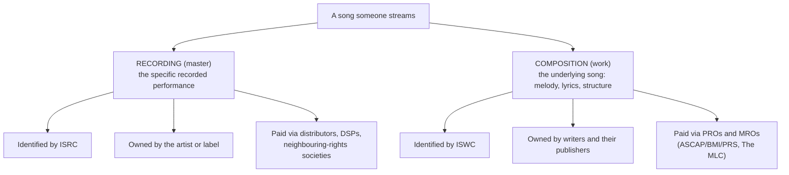
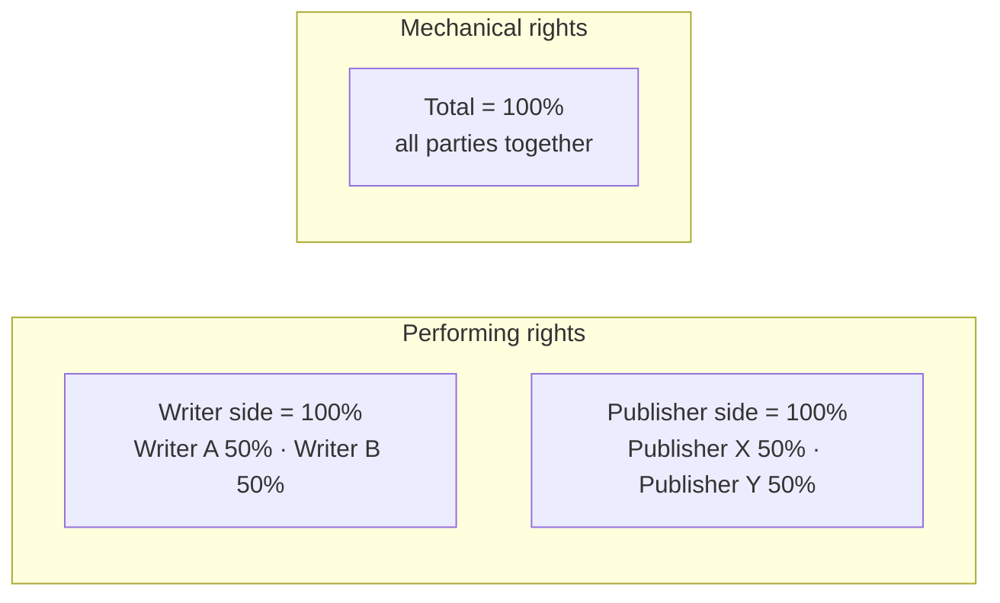

# Domain glossary

Read this before touching schema, matching, or rules.

Music rights terminology is full of words that sound self-explanatory and are not. Nearly every
expensive defect in a system like this traces back to one of four confusions:

1. Treating a **recording** and a **composition** as the same thing.
2. Assuming ownership percentages **sum to 100** in one namespace.
3. Conflating **owning** a share with **collecting** on it.
4. Ignoring that ownership is scoped by **territory** and **time**.

Each is explained below with the reason it matters in code.

---

## The two copyrights in every song

This is the single most important distinction in the domain. **One song is two separate
properties**, owned by potentially different people, earning separately, paid through different
channels.

| | Recording (master) | Composition (work) |
| --- | --- | --- |
| What it is | One specific recorded performance | The song itself |
| Identifier | **ISRC** | **ISWC** |
| Typically owned by | Artist or label | Songwriters + publishers |
| Earns from | Streams, downloads, physical, sync (master side), neighbouring rights | Performance, mechanical, sync (publishing side), print |
| Collected via | Distributor, label, SoundExchange-type bodies | PROs, MROs, publishers |
| In the Source ecosystem | Source Music Group's side | Source Publishing's side |

**Why it matters in code:** thirty recordings of one song share **one ISWC** and have **thirty
different ISRCs**. A cover, a live version, a remix, and a "sped up" edit are four recordings of
one composition. This is why `work` and `recording` are separate tables joined many-to-many by
`work_recording`, and why `recording` deliberately has **no** `work_id` foreign key — recordings
routinely arrive from a distributor statement before anyone knows what composition they embody,
and a medley embodies several.

---

## Identifiers

| Term | Identifies | Shape | Check digit? |
| --- | --- | --- | --- |
| **ISRC** | a recording | `USABC2400001` (12 chars) | **No** — structural validation only |
| **ISWC** | a composition | `T-070.244.437-8` (11 chars) | **Yes** — mod-10, so typos are catchable |
| **IPI** / **CAE** | a party (writer/publisher) | 11 digits, zero-padded | Not reliably present on statements |
| **UPC** / **EAN** / **GTIN** | a release (product) | 12/13/14 digits → normalised to GTIN-14 | **Yes** — GS1 mod-10 |
| **ISNI** | a person or organisation | 16 digits | Yes |

Notes that have bitten real systems:

- **ISRC has no check digit.** A structurally valid ISRC can be completely wrong, and there is
  no offline way to tell. `isValidIsrc` returning true means "well-formed", never "correct".
- **ISRC country codes are not strictly ISO 3166.** `QM`, `QZ`, and `ZZ` are legitimately issued
  to registrants without a national agency. Validating against a country list rejects real data.
- **CAE is the legacy 9-digit form of IPI.** Left-pad to 11 digits and they are the same
  namespace. Statements use both names interchangeably.
- **UPC-A, EAN-13 and GTIN-14 are the same product at different widths.** Normalise to GTIN-14
  by zero-padding, which preserves the check digit. Without this, one album from two
  distributors looks like two products.
- **An all-zero IPI or GTIN is a placeholder** meaning "unknown", not an identity. Never store
  it as one.

See `packages/domain/src/identifiers/`.

---

## Parties and ownership

**Party** — any interested person or company: a writer, publisher, administrator, producer,
label, or society. Parties are identified by IPI, not by name; two different writers called
"John Smith" is a routine situation, not an edge case.

**Split / share** — a party's percentage interest in a work or recording, for a given right, in
a given territory, for a given term.

### Splits do not sum to 100 (in the way you expect)

Performance rights are conventionally expressed as **two separate 100% universes**:

- **Writer side** sums to 100% across the writers.
- **Publisher side** sums to 100% across the publishers.

Mechanical rights are typically a **single** 100%.

**Why it matters in code:** a naive "shares must sum to 100" validation fires a false positive
on **every correctly-entered work**. This is why `work_share.share_basis` exists
(`writer_side | publisher_side | total`), and why the `split_sum_mismatch` rule groups by
`(right_type, share_basis, territory, overlapping term)` before summing anything.

### Ownership percentage ≠ collection percentage

A publisher can **own** 50% of a work while **collecting** 100% of it in a territory under an
administration agreement. These are two different numbers and one field cannot hold both.
Conflating them produces confidently wrong "you are under-collecting" findings — which is worse
than no finding at all. Hence separate `ownership_pct` and `collection_pct`.

### Ownership is scoped by territory and by time

- **Territory** — expressed in the real world as `WORLD`, an ISO country code, or most commonly
  **"World except US"**. Storing a flat country list is technically tidier but nobody's
  paperwork reads that way and round-tripping loses intent. Hence `territory` plus
  `territory_excludes[]`.
- **Term** — shares have a start and often an end. **Reversion** (rights returning to the
  writer at the end of a term) is normal. A 2019 statement must be evaluated against the share
  picture as it stood in 2019, not today's.

Overlapping terms are a **finding** (`split_overlap_conflict`), deliberately not a database
constraint — real catalogs contain them and a constraint would block ingesting the truth.

### `share_completeness`

A work is marked `unknown`, `partial_by_design`, or `asserted_complete`. Only once a user
asserts a work's shares are complete does the split-sum rule apply to it. Without this field,
every half-entered work generates noise and users learn to ignore the rules.

---

## Money and revenue

| Term | Meaning |
| --- | --- |
| **Performance royalty** | Earned when a work is performed publicly — radio, venues, live, and the performance share of streams. Collected by **PROs**. |
| **Mechanical royalty** | Earned when a work is reproduced — the mechanical share of streams, downloads, physical. In the US largely collected by **The MLC**. |
| **Sync** | Earned when music is licensed into film, TV, ads, games. Negotiated per placement; has both a master side and a publishing side. |
| **Print** | Sheet music and licensed lyric reprints. Small but real. |
| **Neighbouring rights** | Performance income on the **recording** (not the composition), paid to performers and masters owners. |
| **Reversal / chargeback** | A negative line correcting an earlier overpayment. Must be visible, and must not be silently netted into "revenue". |
| **Recoupment** | Recovery of an advance against future royalties. Not modelled in Phase 1. |

**Organisations**

- **DSP** — Digital Service Provider. Spotify, Apple Music, YouTube.
- **Distributor** — gets recordings to DSPs and pays the master side. DistroKid, TuneCore, Amuse.
- **PRO** — Performing Rights Organisation. ASCAP, BMI, SESAC, PRS, SOCAN, GEMA.
- **MRO** — Mechanical Rights Organisation. The MLC (US), MCPS (UK).
- **Administrator** — manages registration and collection for a publisher or writer **without
  taking ownership**. This is Source Publishing's role, and the distinction from "publisher" is
  contractual and material.

**Money in code:** always `numeric(18,6)` with an explicit `char(3)` currency, and `decimal.js`
at boundaries. Never a JavaScript float. In a product whose entire claim is accuracy, a rounding
artifact is not a cosmetic bug. Phase 1 aggregates **per currency** and labels it; FX conversion
is deliberately deferred rather than done approximately.

---

## Statements and ingestion

| Term | Meaning |
| --- | --- |
| **Statement** | A periodic file from a distributor, PRO, MRO, or publisher reporting earnings. |
| **Statement line** | One row: some identifier(s), a usage type, a period, an amount. |
| **Format** | A specific source's file layout, recognised by a hash of its normalised headers. Sources change layouts without notice. |
| **Reconciliation** | Comparing our parsed total against the total the file itself declares. Catches **our own parser bugs** and blocks commit on mismatch. |
| **Commit** | The explicit human action that makes a parsed file trusted. Nothing feeds rollups, matching, or issues before it. |
| **Match** | Associating a statement line with a catalog recording or work. |
| **Unmatched line** | A line we could not associate. A first-class product surface, never dropped and never guessed at. |
| **Alias** | A confirmed mapping from a source's identifier to our entity, so the same question is never asked twice. |

**Why "unmatched" is a feature:** the honest statement is that revenue arrived which we could not
associate with the user's catalog. That is a real, reportable figure, quoted from the statement
itself. It is emphatically **not** an assertion that the user is entitled to that sum — we do not
know that, and saying so would be a prohibited claim.

---

## Terms deliberately avoided

Several words that are perfectly normal in industry conversation create legal exposure in a
product UI — words implying authority over a third party's books, a guaranteed outcome, or that
money has been located rather than that data is inconsistent.

That list is **not duplicated here**, deliberately: it is machine-enforced and lives in exactly one
place, with the reasoning for each entry. Two copies of a compliance list is two copies that can
disagree.

→ **[../compliance/claims-lexicon.md](../compliance/claims-lexicon.md)** — read it before writing
any user-facing copy. CI fails on violations, including in these docs.
