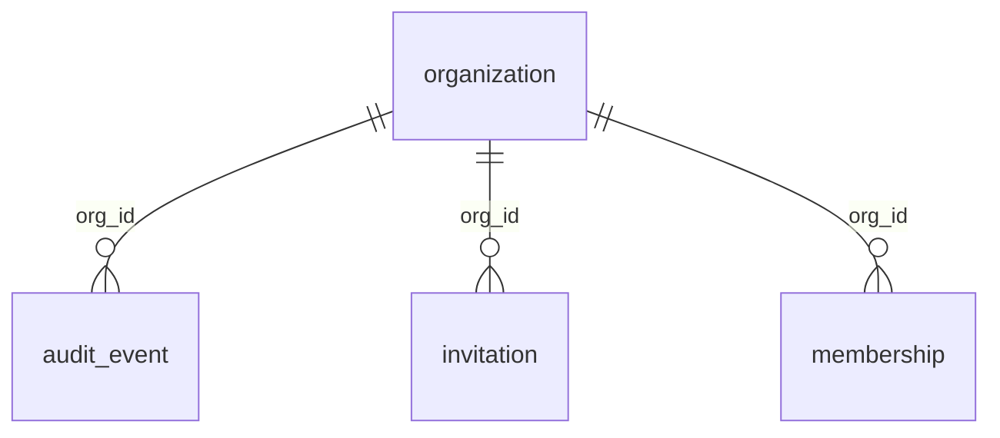
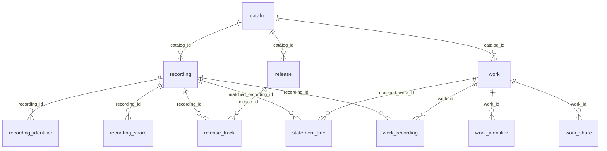
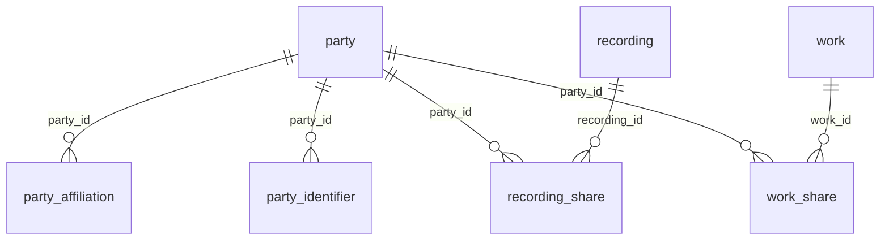
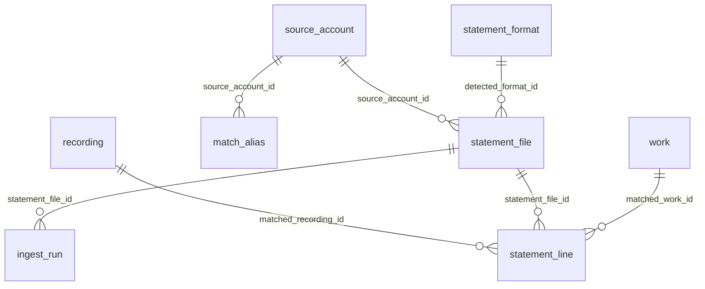
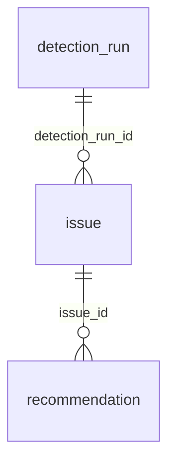

<!-- GENERATED FILE — do not edit by hand.
     Run `pnpm docs:generate`. CI fails if this file is stale. -->

# Schema reference (generated)

Generated from `packages/db/src/schema`. **27 tables.**

This file documents *structure*. For the reasoning behind non-obvious columns see
[schema.md](schema.md) and the `COMMENT ON` statements in `packages/db/migrations/`.

Conventions that hold throughout:

- Every table carries `org_id` except `organization` itself. `audit_event` and
  `statement_format` allow it to be NULL, deliberately — see [schema.md](schema.md).
- Money is `numeric(18, 6)` and always paired with a currency column.
- Soft-deletable tables have `deleted_at`, and their unique indexes are partial.

> The diagrams below **omit the universal `org_id` → `organization` edge** except in
> the Tenancy diagram. Every table has one; drawing all 26 buries the structure that
> actually varies.

## Entity relationships

### Tenancy

### Catalog

### Parties & ownership

### Ingestion

### Analysis

## Tables

### Tenancy

#### `audit_event`

| Column | Type | Null | Key |
| --- | --- | --- | --- |
| `id` | `bigint` | no | PK |
| `org_id` | `uuid` | yes | FK → organization |
| `actor_user_id` | `char(64)` | yes | — |
| `action` | `text` | no | — |
| `entity_type` | `text` | yes | — |
| `entity_id` | `text` | yes | — |
| `ip` | `inet` | yes | — |
| `user_agent` | `text` | yes | — |
| `metadata` | `jsonb` | yes | — |
| `created_at` | `timestamp with time zone` | no | — |

Indexes:

- `audit_event_action_idx`
- `audit_event_entity_idx`
- `audit_event_org_created_idx`

#### `invitation`

| Column | Type | Null | Key |
| --- | --- | --- | --- |
| `id` | `uuid` | no | PK |
| `org_id` | `uuid` | no | FK → organization |
| `email` | `text` | no | — |
| `role` | `org_role` | no | — |
| `token_hash` | `char(64)` | no | — |
| `status` | `invitation_status` | no | — |
| `invited_by_user_id` | `char(64)` | no | — |
| `expires_at` | `timestamp with time zone` | no | — |
| `accepted_at` | `timestamp with time zone` | yes | — |
| `accepted_by_user_id` | `char(64)` | yes | — |
| `created_at` | `timestamp with time zone` | no | — |

Indexes:

- `invitation_email_idx`
- `invitation_org_status_idx`
- `invitation_token_hash_key` *(unique)*

#### `membership`

| Column | Type | Null | Key |
| --- | --- | --- | --- |
| `id` | `uuid` | no | PK |
| `org_id` | `uuid` | no | FK → organization |
| `user_id` | `char(64)` | no | — |
| `role` | `org_role` | no | — |
| `created_at` | `timestamp with time zone` | no | — |
| `deleted_at` | `timestamp with time zone` | yes | — |

Indexes:

- `membership_org_user_key` *(unique, partial)*
- `membership_user_idx`

#### `organization`

| Column | Type | Null | Key |
| --- | --- | --- | --- |
| `id` | `uuid` | no | PK |
| `created_by_user_id` | `char(64)` | no | — |
| `name` | `text` | no | — |
| `slug` | `text` | no | — |
| `retention_months` | `integer` | no | — |
| `created_at` | `timestamp with time zone` | no | — |
| `updated_at` | `timestamp with time zone` | yes | — |
| `deleted_at` | `timestamp with time zone` | yes | — |

Indexes:

- `organization_slug_key` *(unique, partial)*

### Catalog

#### `catalog`

| Column | Type | Null | Key |
| --- | --- | --- | --- |
| `id` | `uuid` | no | PK |
| `org_id` | `uuid` | no | FK → organization |
| `name` | `text` | no | — |
| `kind` | `catalog_kind` | no | — |
| `default_currency` | `char(3)` | yes | — |
| `created_at` | `timestamp with time zone` | no | — |
| `updated_at` | `timestamp with time zone` | yes | — |
| `deleted_at` | `timestamp with time zone` | yes | — |

Indexes:

- `catalog_org_idx`

#### `recording`

| Column | Type | Null | Key |
| --- | --- | --- | --- |
| `id` | `uuid` | no | PK |
| `org_id` | `uuid` | no | FK → organization |
| `catalog_id` | `uuid` | no | FK → catalog |
| `title` | `text` | no | — |
| `title_norm` | `text` | no | — |
| `version_label` | `text` | yes | — |
| `isrc` | `char(12)` | yes | — |
| `display_artist` | `text` | yes | — |
| `artist_norm` | `text` | yes | — |
| `duration_ms` | `integer` | yes | — |
| `release_date` | `date` | yes | — |
| `label_name` | `text` | yes | — |
| `origin` | `entity_origin` | no | — |
| `created_at` | `timestamp with time zone` | no | — |
| `updated_at` | `timestamp with time zone` | yes | — |
| `deleted_at` | `timestamp with time zone` | yes | — |

Indexes:

- `recording_org_catalog_idx`
- `recording_org_isrc_key` *(unique, partial)*
- `recording_title_norm_trgm_idx` *(gin)*

#### `recording_identifier`

| Column | Type | Null | Key |
| --- | --- | --- | --- |
| `id` | `uuid` | no | PK |
| `org_id` | `uuid` | no | FK → organization |
| `recording_id` | `uuid` | no | FK → recording |
| `scheme` | `recording_identifier_scheme` | no | — |
| `value_norm` | `text` | no | — |
| `value_raw` | `text` | yes | — |
| `source` | `text` | yes | — |
| `created_at` | `timestamp with time zone` | no | — |
| `verified_at` | `timestamp with time zone` | yes | — |

Indexes:

- `recording_identifier_key` *(unique)*
- `recording_identifier_lookup_idx`
- `recording_identifier_recording_idx`

#### `release`

| Column | Type | Null | Key |
| --- | --- | --- | --- |
| `id` | `uuid` | no | PK |
| `org_id` | `uuid` | no | FK → organization |
| `catalog_id` | `uuid` | no | FK → catalog |
| `gtin` | `char(14)` | yes | — |
| `title` | `text` | no | — |
| `title_norm` | `text` | no | — |
| `display_artist` | `text` | yes | — |
| `release_date` | `date` | yes | — |
| `type` | `release_type` | yes | — |
| `created_at` | `timestamp with time zone` | no | — |
| `updated_at` | `timestamp with time zone` | yes | — |
| `deleted_at` | `timestamp with time zone` | yes | — |

Indexes:

- `release_org_catalog_idx`
- `release_org_gtin_key` *(unique, partial)*

#### `release_track`

| Column | Type | Null | Key |
| --- | --- | --- | --- |
| `id` | `uuid` | no | PK |
| `org_id` | `uuid` | no | FK → organization |
| `release_id` | `uuid` | no | FK → release |
| `recording_id` | `uuid` | no | FK → recording |
| `disc_no` | `integer` | no | — |
| `track_no` | `integer` | no | — |
| `created_at` | `timestamp with time zone` | no | — |

Indexes:

- `release_track_position_key` *(unique)*
- `release_track_recording_idx`

#### `work`

| Column | Type | Null | Key |
| --- | --- | --- | --- |
| `id` | `uuid` | no | PK |
| `org_id` | `uuid` | no | FK → organization |
| `catalog_id` | `uuid` | no | FK → catalog |
| `title` | `text` | no | — |
| `title_norm` | `text` | no | — |
| `alt_titles` | `text[]` | yes | — |
| `iswc` | `char(11)` | yes | — |
| `language` | `char(3)` | yes | — |
| `duration_seconds` | `integer` | yes | — |
| `share_completeness` | `share_completeness` | no | — |
| `origin` | `entity_origin` | no | — |
| `created_at` | `timestamp with time zone` | no | — |
| `updated_at` | `timestamp with time zone` | yes | — |
| `deleted_at` | `timestamp with time zone` | yes | — |

Indexes:

- `work_org_catalog_idx`
- `work_org_iswc_key` *(unique, partial)*
- `work_title_norm_trgm_idx` *(gin)*

#### `work_identifier`

| Column | Type | Null | Key |
| --- | --- | --- | --- |
| `id` | `uuid` | no | PK |
| `org_id` | `uuid` | no | FK → organization |
| `work_id` | `uuid` | no | FK → work |
| `scheme` | `work_identifier_scheme` | no | — |
| `value_norm` | `text` | no | — |
| `value_raw` | `text` | yes | — |
| `source` | `text` | yes | — |
| `created_at` | `timestamp with time zone` | no | — |
| `verified_at` | `timestamp with time zone` | yes | — |

Indexes:

- `work_identifier_key` *(unique)*
- `work_identifier_lookup_idx`
- `work_identifier_work_idx`

#### `work_recording`

| Column | Type | Null | Key |
| --- | --- | --- | --- |
| `id` | `uuid` | no | PK |
| `org_id` | `uuid` | no | FK → organization |
| `work_id` | `uuid` | no | FK → work |
| `recording_id` | `uuid` | no | FK → recording |
| `link_type` | `work_recording_link_type` | no | — |
| `link_source` | `link_source` | no | — |
| `confidence` | `numeric(4, 3)` | yes | — |
| `confirmed_by_user_id` | `char(64)` | yes | — |
| `confirmed_at` | `timestamp with time zone` | yes | — |
| `created_at` | `timestamp with time zone` | no | — |

Indexes:

- `work_recording_key` *(unique)*
- `work_recording_recording_idx`
- `work_recording_work_idx`

### Parties & ownership

#### `party`

| Column | Type | Null | Key |
| --- | --- | --- | --- |
| `id` | `uuid` | no | PK |
| `org_id` | `uuid` | no | FK → organization |
| `name` | `text` | no | — |
| `sort_name` | `text` | yes | — |
| `name_norm` | `text` | no | — |
| `kind` | `party_kind` | no | — |
| `is_self` | `boolean` | no | — |
| `notes` | `text` | yes | — |
| `created_at` | `timestamp with time zone` | no | — |
| `updated_at` | `timestamp with time zone` | yes | — |
| `deleted_at` | `timestamp with time zone` | yes | — |

Indexes:

- `party_name_norm_trgm_idx` *(gin)*
- `party_org_idx`
- `party_org_self_idx` *(partial)*

#### `party_affiliation`

| Column | Type | Null | Key |
| --- | --- | --- | --- |
| `id` | `uuid` | no | PK |
| `org_id` | `uuid` | no | FK → organization |
| `party_id` | `uuid` | no | FK → party |
| `society` | `society` | no | — |
| `role` | `text` | no | — |
| `member_id` | `text` | yes | — |
| `effective_from` | `date` | yes | — |
| `effective_to` | `date` | yes | — |
| `created_at` | `timestamp with time zone` | no | — |

Indexes:

- `party_affiliation_party_idx`

#### `party_identifier`

| Column | Type | Null | Key |
| --- | --- | --- | --- |
| `id` | `uuid` | no | PK |
| `org_id` | `uuid` | no | FK → organization |
| `party_id` | `uuid` | no | FK → party |
| `scheme` | `party_identifier_scheme` | no | — |
| `value_norm` | `text` | no | — |
| `value_raw` | `text` | yes | — |
| `source` | `text` | yes | — |
| `created_at` | `timestamp with time zone` | no | — |

Indexes:

- `party_identifier_key` *(unique)*
- `party_identifier_lookup_idx`

#### `recording_share`

| Column | Type | Null | Key |
| --- | --- | --- | --- |
| `id` | `uuid` | no | PK |
| `org_id` | `uuid` | no | FK → organization |
| `recording_id` | `uuid` | no | FK → recording |
| `party_id` | `uuid` | no | FK → party |
| `role` | `recording_share_role` | no | — |
| `right_type` | `recording_right_type` | no | — |
| `ownership_pct` | `numeric(7, 4)` | yes | — |
| `collection_pct` | `numeric(7, 4)` | yes | — |
| `territory` | `text` | no | — |
| `territory_excludes` | `text[]` | yes | — |
| `term_start` | `date` | yes | — |
| `term_end` | `date` | yes | — |
| `source` | `share_source` | no | — |
| `evidence_ref` | `text` | yes | — |
| `confirmed_by_user_id` | `char(64)` | yes | — |
| `confirmed_at` | `timestamp with time zone` | yes | — |
| `created_at` | `timestamp with time zone` | no | — |
| `updated_at` | `timestamp with time zone` | yes | — |
| `deleted_at` | `timestamp with time zone` | yes | — |

Indexes:

- `recording_share_party_idx`
- `recording_share_recording_idx` *(partial)*

#### `registration`

| Column | Type | Null | Key |
| --- | --- | --- | --- |
| `id` | `uuid` | no | PK |
| `org_id` | `uuid` | no | FK → organization |
| `subject_type` | `registration_subject` | no | — |
| `subject_id` | `uuid` | no | — |
| `registry` | `society` | no | — |
| `external_id` | `text` | yes | — |
| `status` | `registration_status` | no | — |
| `registered_shares_snapshot` | `jsonb` | yes | — |
| `evidence_storage_key` | `text` | yes | — |
| `source` | `registration_source` | no | — |
| `last_checked_at` | `timestamp with time zone` | yes | — |
| `checked_by` | `char(64)` | yes | — |
| `created_at` | `timestamp with time zone` | no | — |
| `updated_at` | `timestamp with time zone` | yes | — |

Indexes:

- `registration_stale_idx`
- `registration_subject_idx`
- `registration_subject_registry_key` *(unique)*

#### `work_share`

| Column | Type | Null | Key |
| --- | --- | --- | --- |
| `id` | `uuid` | no | PK |
| `org_id` | `uuid` | no | FK → organization |
| `work_id` | `uuid` | no | FK → work |
| `party_id` | `uuid` | no | FK → party |
| `role` | `work_share_role` | no | — |
| `right_type` | `work_right_type` | no | — |
| `share_basis` | `share_basis` | no | — |
| `ownership_pct` | `numeric(7, 4)` | yes | — |
| `collection_pct` | `numeric(7, 4)` | yes | — |
| `territory` | `text` | no | — |
| `territory_excludes` | `text[]` | yes | — |
| `term_start` | `date` | yes | — |
| `term_end` | `date` | yes | — |
| `source` | `share_source` | no | — |
| `evidence_ref` | `text` | yes | — |
| `confirmed_by_user_id` | `char(64)` | yes | — |
| `confirmed_at` | `timestamp with time zone` | yes | — |
| `created_at` | `timestamp with time zone` | no | — |
| `updated_at` | `timestamp with time zone` | yes | — |
| `deleted_at` | `timestamp with time zone` | yes | — |

Indexes:

- `work_share_party_idx`
- `work_share_rule_idx`
- `work_share_work_idx` *(partial)*

### Ingestion

#### `ingest_run`

| Column | Type | Null | Key |
| --- | --- | --- | --- |
| `id` | `uuid` | no | PK |
| `org_id` | `uuid` | no | FK → organization |
| `statement_file_id` | `uuid` | no | FK → statement_file |
| `step` | `text` | no | — |
| `started_at` | `timestamp with time zone` | no | — |
| `finished_at` | `timestamp with time zone` | yes | — |
| `input_count` | `integer` | yes | — |
| `output_count` | `integer` | yes | — |
| `error` | `jsonb` | yes | — |

Indexes:

- `ingest_run_file_idx`

#### `match_alias`

| Column | Type | Null | Key |
| --- | --- | --- | --- |
| `id` | `uuid` | no | PK |
| `org_id` | `uuid` | no | FK → organization |
| `source_account_id` | `uuid` | yes | FK → source_account |
| `alias_kind` | `alias_kind` | no | — |
| `alias_value_norm` | `text` | no | — |
| `target_type` | `match_target_type` | no | — |
| `target_id` | `uuid` | no | — |
| `confirmed_by_user_id` | `char(64)` | yes | — |
| `created_at` | `timestamp with time zone` | no | — |
| `hit_count` | `integer` | no | — |

Indexes:

- `match_alias_key` *(unique)*
- `match_alias_target_idx`

#### `source_account`

| Column | Type | Null | Key |
| --- | --- | --- | --- |
| `id` | `uuid` | no | PK |
| `org_id` | `uuid` | no | FK → organization |
| `source_key` | `text` | no | — |
| `source_type` | `source_type` | no | — |
| `display_name` | `text` | no | — |
| `default_currency` | `char(3)` | yes | — |
| `expected_cadence` | `expected_cadence` | no | — |
| `created_at` | `timestamp with time zone` | no | — |
| `updated_at` | `timestamp with time zone` | yes | — |

Indexes:

- `source_account_org_idx`

#### `statement_file`

| Column | Type | Null | Key |
| --- | --- | --- | --- |
| `id` | `uuid` | no | PK |
| `org_id` | `uuid` | no | FK → organization |
| `source_account_id` | `uuid` | yes | FK → source_account |
| `uploaded_by_user_id` | `char(64)` | no | — |
| `original_filename` | `text` | no | — |
| `mime` | `text` | yes | — |
| `byte_size` | `bigint` | yes | — |
| `sha256` | `char(64)` | no | — |
| `storage_key` | `text` | no | — |
| `status` | `statement_file_status` | no | — |
| `detected_format_id` | `uuid` | yes | FK → statement_format |
| `detection_confidence` | `numeric(4, 3)` | yes | — |
| `period_start` | `date` | yes | — |
| `period_end` | `date` | yes | — |
| `statement_currency` | `char(3)` | yes | — |
| `reported_total` | `numeric(18, 6)` | yes | — |
| `parsed_total` | `numeric(18, 6)` | yes | — |
| `row_count` | `integer` | yes | — |
| `error` | `jsonb` | yes | — |
| `created_at` | `timestamp with time zone` | no | — |
| `committed_at` | `timestamp with time zone` | yes | — |
| `committed_by_user_id` | `char(64)` | yes | — |

Indexes:

- `statement_file_org_period_idx`
- `statement_file_org_sha_key` *(unique)*
- `statement_file_org_status_idx`
- `statement_file_source_idx`

#### `statement_format`

| Column | Type | Null | Key |
| --- | --- | --- | --- |
| `id` | `uuid` | no | PK |
| `source_key` | `text` | yes | — |
| `name` | `text` | no | — |
| `version` | `integer` | no | — |
| `file_kind` | `statement_file_kind` | no | — |
| `header_fingerprint` | `char(64)` | no | — |
| `sample_headers` | `text[]` | yes | — |
| `sheet_name` | `text` | yes | — |
| `header_row_index` | `integer` | no | — |
| `column_map` | `jsonb` | no | — |
| `number_format` | `jsonb` | yes | — |
| `date_format` | `text` | yes | — |
| `encoding` | `text` | yes | — |
| `sensitive_fields` | `text[]` | yes | — |
| `scope` | `format_scope` | no | — |
| `org_id` | `uuid` | yes | FK → organization |
| `created_by_user_id` | `char(64)` | yes | — |
| `confirmed_at` | `timestamp with time zone` | yes | — |
| `created_at` | `timestamp with time zone` | no | — |

Indexes:

- `statement_format_fingerprint_scope_key` *(unique)*
- `statement_format_lookup_idx`
- `statement_format_source_idx`

#### `statement_line`

| Column | Type | Null | Key |
| --- | --- | --- | --- |
| `id` | `bigint` | no | PK |
| `org_id` | `uuid` | no | FK → organization |
| `statement_file_id` | `uuid` | no | FK → statement_file |
| `line_no` | `integer` | no | — |
| `raw` | `jsonb` | no | — |
| `reported_title` | `text` | yes | — |
| `reported_artist` | `text` | yes | — |
| `reported_writer` | `text` | yes | — |
| `reported_publisher` | `text` | yes | — |
| `reported_isrc` | `char(12)` | yes | — |
| `reported_iswc` | `char(11)` | yes | — |
| `reported_gtin` | `char(14)` | yes | — |
| `reported_track_no` | `integer` | yes | — |
| `reported_source_track_id` | `text` | yes | — |
| `platform` | `text` | yes | — |
| `store_service` | `text` | yes | — |
| `country_code` | `char(2)` | yes | — |
| `usage_type` | `usage_type` | no | — |
| `quantity` | `numeric(18, 4)` | yes | — |
| `period_start` | `date` | yes | — |
| `period_end` | `date` | yes | — |
| `gross_amount` | `numeric(18, 6)` | yes | — |
| `net_amount` | `numeric(18, 6)` | yes | — |
| `currency` | `char(3)` | yes | — |
| `fx_rate` | `numeric(18, 8)` | yes | — |
| `amount_base` | `numeric(18, 6)` | yes | — |
| `fx_source` | `fx_source` | no | — |
| `share_pct_reported` | `numeric(7, 4)` | yes | — |
| `is_reversal` | `boolean` | no | — |
| `match_status` | `match_status` | no | — |
| `matched_recording_id` | `uuid` | yes | FK → recording |
| `matched_work_id` | `uuid` | yes | FK → work |
| `match_confidence` | `numeric(4, 3)` | yes | — |
| `match_method` | `match_method` | yes | — |
| `match_candidates` | `jsonb` | yes | — |
| `matched_at` | `timestamp with time zone` | yes | — |
| `matched_by_user_id` | `char(64)` | yes | — |

Indexes:

- `statement_line_file_line_key` *(unique)*
- `statement_line_isrc_idx`
- `statement_line_recording_period_idx`
- `statement_line_review_idx` *(partial)*
- `statement_line_source_track_idx`
- `statement_line_work_period_idx`

### Analysis

#### `detection_run`

| Column | Type | Null | Key |
| --- | --- | --- | --- |
| `id` | `uuid` | no | PK |
| `org_id` | `uuid` | no | FK → organization |
| `ruleset_version` | `text` | no | — |
| `started_at` | `timestamp with time zone` | no | — |
| `finished_at` | `timestamp with time zone` | yes | — |
| `issues_opened` | `integer` | yes | — |
| `issues_closed` | `integer` | yes | — |
| `error` | `jsonb` | yes | — |

Indexes:

- `detection_run_org_idx`

#### `issue`

| Column | Type | Null | Key |
| --- | --- | --- | --- |
| `id` | `uuid` | no | PK |
| `org_id` | `uuid` | no | FK → organization |
| `detection_run_id` | `uuid` | yes | FK → detection_run |
| `rule_key` | `text` | no | — |
| `ruleset_version` | `text` | no | — |
| `severity` | `issue_severity` | no | — |
| `status` | `issue_status` | no | — |
| `subject_type` | `issue_subject` | no | — |
| `subject_id` | `uuid` | yes | — |
| `title` | `text` | no | — |
| `body` | `text` | yes | — |
| `evidence` | `jsonb` | no | — |
| `estimated_value` | `numeric(18, 6)` | yes | — |
| `estimated_currency` | `char(3)` | yes | — |
| `value_is_estimate` | `boolean` | no | — |
| `estimate_basis` | `text` | yes | — |
| `estimate_confidence` | `estimate_confidence` | yes | — |
| `fingerprint` | `text` | no | — |
| `created_at` | `timestamp with time zone` | no | — |
| `last_detected_at` | `timestamp with time zone` | no | — |
| `resolved_at` | `timestamp with time zone` | yes | — |
| `resolution_note` | `text` | yes | — |
| `dismissed_reason` | `text` | yes | — |
| `dismissed_by_user_id` | `char(64)` | yes | — |
| `updated_at` | `timestamp with time zone` | yes | — |

Indexes:

- `issue_fingerprint_key` *(unique)*
- `issue_org_status_severity_idx`
- `issue_rule_idx`
- `issue_subject_idx`

Check constraints:

- `issue_value_requires_basis`
- `issue_value_requires_currency`

#### `recommendation`

| Column | Type | Null | Key |
| --- | --- | --- | --- |
| `id` | `uuid` | no | PK |
| `org_id` | `uuid` | no | FK → organization |
| `issue_id` | `uuid` | yes | FK → issue |
| `action_type` | `recommendation_action` | no | — |
| `title` | `text` | no | — |
| `rationale` | `text` | yes | — |
| `effort` | `impact_band` | no | — |
| `impact_band` | `impact_band` | no | — |
| `status` | `recommendation_status` | no | — |
| `assigned_to_user_id` | `char(64)` | yes | — |
| `due_date` | `date` | yes | — |
| `evidence` | `jsonb` | yes | — |
| `created_at` | `timestamp with time zone` | no | — |
| `updated_at` | `timestamp with time zone` | yes | — |

Indexes:

- `recommendation_issue_idx`
- `recommendation_org_status_idx`
- `recommendation_ranking_idx`
